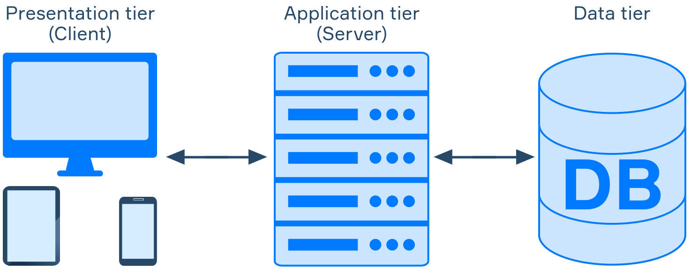

<div align="center">
    
</div>

# Table of content
1. [Devops Challenge](#req)
    - [Description](#desc)    
    - [Assignment](#Asmnt)
2. [Evaluation Criteria](#min_req) 
3. [Architecture](#arct)
4. [Phase 1 ( How to run the project Locally using Docker)](#local)
5. [Phase 2 ( Containerizing the 3tier web app Using Docker)](#docker)
6. [Phase 3 ( Building CI to push the 3tier web app to dockerhub using Jenkins)](#jenkins)
7. [Phase 4 ( Deploying the 3tier web app with Kubernetes using Deployment, Services and Ingress)](#Kubernetes)
8. [Phase 5 ( Deploying the 3tier web app with Helm Charts)](#helm)
9. [Phase 6 ( Building CD of the 3tier web app Using ArgoCD and Helm Charts)](#argocd)
10. [Phase 7 ( How to test the 3tier web app from anywhere )](#remote)
11. [Time for some Screen Shots](#screen_shots)

## Devops Challenge <a name="req"></a>

## Description <a name="desc"></a>
You have been tasked with deploying a new application in a containerized environment using Docker and Kubernetes. 

## Assignment <a name="Asnmt"></a>
Your task is to design and implement a solution that meets the following requirements:
* Setup a sample web application. For example, a basic PHP web app using Laravel.
* The application must have 3 or more components. For example: A database, a cache service, and a backend.
* Containerize it using Docker.
* Use Kubernetes to manage the lifecycle of the containers, including deployment, scaling and management.
* Deploy the application using Helm.
* Implement continuous integration and delivery pipelines. Use the tool of your choice.
Using Gitlab CI is a plus.
Expected Outcome:
* A design diagram for the application and how it is distributed inside your cluster.
* Docker files, CI/CD configuration, Helm chart, and Kubernetes manifests.
* A README that contains:
* How to deploy the application. Including all the steps needed to have the application up and running on a Kubernetes cluster.
* A listing of the assumptions made and how you prioritized the requirements.
* A summary of the testing process, including any issues encountered and how they were resolved.

## Evaluation Criteria <a name="min_req"></a>
The evaluation will be based on the completeness and quality of the solution, including the
following criteria:
* Correctness: Does the solution meet all the requirements listed above?
* Quality: Well-organized, easy to read, and maintainable.
* Documentation: Is there clear and concise documentation provided for the solution,
including instructions for installation and troubleshooting?

## Architecture <a name="arct"></a>

1. A user opens the `frontend` on `localhost:3000` 
2. clicks on `ADD Todo` and a small window will pop up asking for the title of todo item, a descrption and the due data 
3. and once the user clicks on `Save` a request is sent to the `api backend` 
4. which then stores the data in a `mongo db` 
5. and the saved info gets displayed to the user.


## Phase 1 ( How to run the project Locally using Docker) <a name="how_to_run"></a>
- Make sure you have Docker installed and running using their [official website](https://docs.docker.com/get-docker/).
- At the command prompt simply type 
    ```bash 
    docker-compose up
    ```
- Docker will then create the [MongoDB](https://www.mongodb.com/) from the stock [mongo](https://hub.docker.com/_/mongo) image. The api uses [nodejs](https://nodejs.org/) with [express](http://expressjs.com/) and is built from a [node:alpine](https://hub.docker.com/_/node) image. The front end uses [ReactJS](https://reactjs.org/) and built from a [node:alpine](https://hub.docker.com/_/node) image.

## Phase 2 ( containerizing the web app using Docker)<a name="docker"></a>

- You can build a docker image using this command and tag it using the `-t`
    ```bash
    docker build -f ./frontend/Dockerfile -t ahmedsoliman202/3tier-frontend-app .
    docker build -f ./backend/Dockerfile -t ahmedsoliman202/3tier-backend-app .
    ```
- Before running the `backend-app` and `frontend-app` containers, We have to 
    - 1- create a network to be used by the 3 containers using this command 
    ```bash
    docker network create mongodb
    ```
    - 2- run a db container first, passing all the required Environment Variables, voluem, network and right ports
    ```bash
    docker run -d  --name mongo  -p 27017:27017 -e MONGO_INITDB_ROOT_USERNAME=username -e MONGO_INITDB_ROOT_PASSWORD=password -v mongodb_data:/data/db --network mongodb mongo
    ```
- After building the `backend-app` and `frontend-app` images, it is time to test them, passing the required Environment Variables, network and right ports
    ```bash
    docker run -d --name backend  -p 3001:3001 --network mongodb 3tier-backend-app
    docker run -d --name frontend -p 3000:3000 --network mongodb 3tier-frontend-app
    ```

- Wrote a `docker-compose.yml` file to eaisly spin up the 3 tier web app containers all together with one command

    - if you are using a `Unix/Linux` OS then docker-compose doesn't come installed with Docker so you have to install it manually from [here](https://docs.docker.com/compose/install/standalone/)
    - You can run a docker compose file using the following command
        ```bash
        docker-compose up
        ```
- Side Note: 
    - once the backend app starts, it tries to connect to the db, that's why we launch the db container first but in case of docker-compose. both backend-app and db containers start immediately, and the db container haven't loaded yet so the backend-app crashes and to fix this issue, I implemented the following approache:
        - Added a `depends_on` tag in the backend-app section to force the container to wait till the db container is up and running and then start the backend container
    - I used -f with `docker build` to specifiy the location of Dockerfile and `.` to specify the location which includes the files Dockerfile deals with

## Phase 3 ( building CI to push the web app to dockerhub using Jenkins)<a name="jenkins"></a>

- Make sure to have Jenkins installed using [their website here](https://www.jenkins.io/doc/book/installing/) .

- You have to rename the docker image to include you dockerhub username

    - You can rename a docker image using this command
    ```bash
    docker tag 3tier-backend-app:latest ahmedsoliman202/3tier-backend-app:latest
    docker tag 3tier-frontend-app:latest ahmedsoliman202/3tier-frontend-app:latest
    ```
    - You can push a docker image to dockerhub using this command
    ```bash
    docker push ahmedsoliman202/3tier-backend-app:latest
    docker push ahmedsoliman202/3tier-frontend-app:latest
    ```
- Backend created image can be found here [backend-image:latest](https://hub.docker.com/repository/docker/ahmedsoliman202/3tier-backend-app/general)
- Frontend created image can be found here [frontend-image:latest](https://hub.docker.com/repository/docker/ahmedsoliman202/3tier-frontend-app/general)
- Side Note: 
    - in order to use Jenkins to build and push docker images the host pc must have docker installed and in my case I accessed the Jenkins container and mounted docker socket volume into the Jenkins container to enable the execution of Docker commands on the host machine
    - another nice alternative is using this docker image which has light Jenkins image
    ```bash
    docker run -p 8080:8080 -v /var/run/docker.sock:/var/run/docker.sock liatrio/jenkins-alpine
    ```

## Phase 4 ( deploying the web app with Kubernetes using Deployment, Services and Ingress)<a name="Kubernetes"></a>

- Make sure you have `kubectl`,`minikube` installed from the [Kubernetes docs](https://kubernetes.io/docs/tasks/tools/)

    - You also must have a `minikube driver` installed, in my case I used `Docker Desktop`
    - In order to interact with the minikube cluster you have have to start it using this command
        ```bash
        minikube start
        ```
- Since the backend-app depends on the db, We have to apply db kubernetes manifest first using this command
    ```bash
     k create -f ./kubernetes_mainfests/db-deployment.yaml
    ````
    - To see if the pod, pv, pvc were created successfully and running, using this command to list all the pods in a cluster node
        ```bash
        kubectl get pods
        kubectl get pv
        kubectl get pvc
        ```
- Second step is to deploy the web app using this command
    ```bash
     k create -f ./kubernetes_mainfests/backend-deployment.yaml
     k create -f ./kubernetes_mainfests/frontend-deployment.yaml
    ````
- I defined a k8 `Service` resource in `backend-deployment.yaml` and `frontend-deployment.yaml` of type `NodePort` so that I can Expose the web app to the public

    - In order to access the web app publicly, We have to get the cluster ip using this command
        ```bash
        minikube ip
        ```
    - I have set the `NodePort` to `30008` so we can use the cluster ip along with the nodeport to test the app, The url will be something like `http://192.168.197.128:30008`
    - Another approach will be to ask minikube to expose the service and open it in the browser using the follwing command
        ```bash
        minikube service frontend-app-svc
        ```
- I defined a k8 `Ingress` resource in `ingress.yaml` of path type [`Prefix`](https://kubernetes.io/docs/concepts/services-networking/ingress/#path-types) and type [`Simple Fanout`](https://kubernetes.io/docs/concepts/services-networking/ingress/#simple-fanout) so that I can Expose the web app to the public and access it using human readable host like `robusta.io` and ingress will take care of routing the traffic based on the `URI` to the right servies and hence to the right pods
    - 
    - In order to deploy the ingress manifest, We can use this command
        ```bash
        k create -f ./kubernetes_mainfests/ingress.yaml
        ```
    - Now we need to add a rule in minikube to route the traffic using minikube ip (`192.168.49.2`) to the host (`robusta.io`) which we added in the ingress as follows:
        ```bash
        minikube ssh
        sudo /bin/sh -c 'echo "192.168.49.2 robusta.io" >> /etc/hosts'
        ```

    - to test the web app, within the minikube ssh session we can query the URLS of our 3tier web app
        ```bash
        curl robusta.io/
        curl robusta.io/backend
        curl robusta.io/db
        ```

- Side Note:
    - I have set the `replicas` in the `backend-deployment.yaml` and `frontend-deployment.yaml` to `5` to achieve high availability of the service.
    - I have defined a `PersistentVolume` resource in `db-deployment.yaml` to achieve volume persistence.


## Phase 5 ( deploying the web app with Helm Charts)<a name="helm"></a>

- Make sure to have Helm installed from [official docs](https://helm.sh/docs/intro/install/).

- You can create a `Helm Chart` using this command 
    ```bash
    helm create chartnamehere
    ```
- You can verify the helm charts before deploying by generating the template using this command
    ```bash
    helm template --output-dir ./charts-test-templates --values=./helm_charts/backend-app/values.yaml ./helm_charts/backend-app/
    ```
- Like we did in kubernetes, We will deploy db first using this command
    ```bash
    helm install mongo --values=./helm_charts/db/values.yaml ./helm_charts/db
    ```
- Then we deploy web app using this command
    ```bash
    helm install backend-app --values=./helm_charts/backend-app/values.yaml ./helm_charts/backend-app/
    helm install frontend-app --values=./helm_charts/frontend-app/values.yaml ./helm_charts/frontend-app/
    ```
- Side Note:
    - I have defined a `HorizontalPodAutoscaler` resource in `hpa.yaml` to achieve autoscaling and high availability of the service. 

## Phase 6 ( building CD of the web app Using ArgoCD and Helm Charts)<a name="argocd"></a>

- First thing to do before installing Argocd is to create a kubernete namespace for argocd using this command 
    ```bash
    kubectl create namespace argocd
    ```
- Make sure to have ArgoCD installed from [official docs](https://arbackend-cd.readthedocs.io/en/stable/getting_started/).

    - You can get the Url where Argocd is hosted, it will be something like `http://192.168.197.128:30196` by using this command
        ```bash
        minikube service argocd-server -n argocd --url
        ```
    - Default username is `admin` and the password can be loacated using this command
        ```bash
        kubectl -n argocd get secret argocd-initial-admin-secret -o jsonpath='{.data.password}' | base64 -
        ```
- To interact with Argocd, You have to install ArgoCD CLI:
    - from [ArgoCD CLI official docs](https://arbackend-cd.readthedocs.io/en/stable/getting_started/)
    - Or you can download the release from their [github release page](https://github.com/argoproj/arbackend-cd/releases) and make sure the version you installed matches the release version.
    - After installing argocd cli, You need to login because the cli doesn't know where to find the instance running argocd
        - Once Argocd Cli is installed, We login to Argocd using the service url from above by using this command
        ```bash
        argocd login 192.168.197.128:30196
        ```
        - A good place to find reliable examples on how to use the CLi, creating applications, Using UI, can be found [Offcial Docs](https://arbackend-cd.readthedocs.io/en/stable/getting_started/)

- Like we did in kubernetes & Helm We will deploy db first using this command
    ```bash
    argocd app create -f ./argocd_files/db-mainfest.yaml
    ```
- Then we deploy web app through Argocd Cli using this command 
    ```bash
    argocd app create -f ./argocd_files/backend-mainfest.yaml
    argocd app create -f ./argocd_files/frontend-mainfest.yaml
    ```
- We can access the web app, it will be something like `http://192.168.197.128:30008` using this command
    ```bash
    minikube service backend-app-svc -n argocd --url
    ```
- Side Note:
    - If you are using windows, make sure to rename the downloaded argocd cli from `argocd-windows-amd64.exe` to `argocd.exe`
    - Aslo make sure to add `argocd.exe` location to windows environment variable `path`

## Phase 7 ( How to test the 3tier web app from anywhere )<a name="remote"></a>

- I'm hosting the containerized 3tier web app on an AWS EC2 instatnce.
- Frontend app can be accessed through this URL:
    ```bash
    http://http://52.10.23.104:3000
    ```
- Backend app endpoint can be accessed through this URL:
    ```bash
    http://http://52.10.23.104:3001/api
    ```
## Time for some Screen Shots<a name="screen_shots"></a>
- Running the web app locally

- Testing The app while it's running through docker-compose

- Building a Docker image

- Starting backend-app container and db-container through docker-compose

- Running Jenkins stages to build and push the docker image to Dockerhub

- Jenkins successfully built and pushed the docker image to Dockerhub

- Docker image repo on Dockerhub

- Deploying web app and db on kubernetes using minikube cluster


- Deploying backend-app and db on kubernetes using Helm charts

